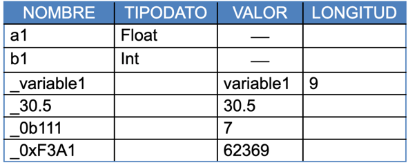

## Temas comunes

### While

[Ejemplo](ejemplos/while.txt)

### If

[Ejemplo](ejemplos/if.txt)

### Asignaciones

[Ejemplo](ejemplos/assignments.txt)

### Tipos de datos

- Float (32 bits): el separador decimal será el punto “.”
- Int (16 bits)
- String: constantes de 40 caracteres alfanuméricos como máximo, limitada por comillas (“ “) ,de la forma “XXXX”

[Ejemplo](ejemplos/assignments.txt)

### Declaración de variables
Todas las variables deberán ser declaradas dentro de un bloque especial para ese fin,
delimitado por la palabra reservada init dentro de un bloque delimitado por llaves.

[Ejemplo](ejemplos/init.txt)

Cada línea dentro del bloque tendrá la forma: < Lista de Variables> :  Tipo de Dato
La Lista de Variables debe ser una lista de variables separadas por comas.
Pueden existir varias líneas de declaración de tipos, incluso utilizando más de una línea para el mismo tipo.

IMPORTANTE: Las variables no guardan su valor en tabla de símbolos.
Las asignaciones deben ser permitidas, solo en los casos en los que los tipos son compatibles, caso contrario deberá desplegarse un error.

### Comentarios
Deberán estar delimitados por `/*` y `*/` y podrán estar anidados en un solo nivel.

[Ejemplo Comentario](ejemplos/comment.txt)

Nota: Los comentarios se ignoran, de manera que no generan un componente léxico o token

### Entrada y salida
Las salidas y entradas por teclado se implementarán como se muestra en el siguiente ejemplo:

[Ejemplo Entrada](ejemplos/read.txt)

[Ejemplo Salida](ejemplos/write.txt)

### Condiciones
Las condiciones para un constructor de ciclos o de selección pueden ser simples ( a < b )  o múltiples.
Las condiciones múltiples pueden ser hasta dos condiciones simples ligadas a través del operador lógico (AND, OR) o una condición simple con el operador lógico NOT

[Ejemplo AND](ejemplos/and.txt)

[Ejemplo OR](ejemplos/or.txt)

[Ejemplo NOT](ejemplos/not.txt)

### Tabla de Símbolos
La tabla de símbolos tiene la capacidad de guardar las variables y constantes con sus atributos.
Los atributos portan información necesaria para operar con constantes, variables, etc.

